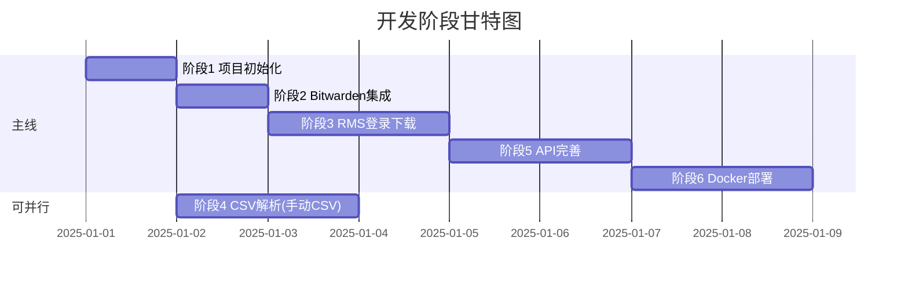

# 乐天 店舗カルテ 自动化项目 - 实施阶段清单

> 本文档基于 [项目方案说明](./rakuten_karte_project_plan.md) 编写，将开发工作划分为 **6 个阶段**，每个阶段包含明确的交付物、验收标准和测试策略。

---

## 阶段概览

| 阶段 | 名称 | 预计工时 | 关键交付物 | 可并行 |
|------|------|----------|------------|--------|
| 1 | 项目初始化与环境搭建 | 2-4h | 项目骨架、基础 API | - |
| 2 | Bitwarden CLI 集成 | 2-4h | `bitwarden.py` 模块 | - |
| 3 | RMS 登录与 CSV 下载 | 4-8h | `fetcher` 模块 | ✓ 与阶段 4 并行 |
| 4 | CSV 解析与 JSON 生成 | 3-6h | `parser` 模块 | ✓ 与阶段 1-3 并行 |
| 5 | API 完善与多店铺支持 | 3-6h | 完整 API 层 | - |
| 6 | Docker 化与生产部署 | 4-8h | Docker 镜像、定时任务 | - |

### 并行开发说明



> **💡 提示**: 阶段 4（CSV 解析）可以在阶段 1 完成后立即开始，**无需等待阶段 2-3 完成**。您可以先手动从 RMS 下载 CSV 文件放入 `data/csv/` 目录，用于开发和测试 parser 模块。这样可以缩短整体开发周期。

---

## 阶段 1：项目初始化与环境搭建

### 目标
搭建项目基础结构，确保开发环境可用。

### 任务清单

- [x] **1.1** 创建项目目录结构（按 `rakuten_karte_project_plan.md` 3.2 节）
- [x] **1.2** 创建 `requirements.txt`，包含以下依赖：
  ```text
  fastapi>=0.104.0
  uvicorn>=0.24.0
  playwright>=1.40.0
  pyyaml>=6.0
  requests>=2.31.0
  ```
- [x] **1.3** 创建 Python 虚拟环境并安装依赖
- [x] **1.4** 安装 Playwright 浏览器：`playwright install chromium`
- [x] **1.5** 创建基础 FastAPI 应用 `app/main.py`，实现 `GET /health` 端点
- [x] **1.6** 创建 `config/shops.yaml` 配置文件模板
- [x] **1.7** 创建 `data/csv/` 和 `data/json/` 目录
- [x] **1.8** 创建 `.gitignore` 和 `.dockerignore` 文件
- [x] **1.9** 创建项目 `README.md`

### 验收标准

1. 运行 `uvicorn app.main:app --reload` 成功启动服务
2. 访问 `http://localhost:8000/health` 返回 `{"status": "ok"}`
3. 目录结构与项目方案一致

### 测试策略

| 测试类型 | 测试方法 | 通过条件 |
|----------|----------|----------|
| 冒烟测试 | `curl http://localhost:8000/health` | 返回 200 + JSON |
| 依赖检查 | `python -c "import playwright; import fastapi; import yaml"` | 无报错 |

---

## 阶段 2：Bitwarden CLI 集成

### 目标
实现从 Vaultwarden 安全获取店铺凭据的能力。

### 前置条件
- 已在 Vaultwarden 中创建乐天店铺的 Login Items
- 已获取 OAuth Client ID 和 Secret
- 本地已安装 `bw` CLI

### 任务清单

- [ ] **2.1** 在 Vaultwarden 中创建测试用 Login Item（如 `rakuten-test-shop`）
- [ ] **2.2** 本地测试 `bw` 命令：
  ```bash
  bw config server https://your-vaultwarden.com
  bw login --apikey
  export BW_SESSION=$(bw unlock --passwordenv BW_PASSWORD --raw)
  bw get item rakuten-test-shop --raw | jq .login
  ```
- [ ] **2.3** 创建 `app/bitwarden.py`，实现 `BitwardenClient` 类
- [ ] **2.4** 创建 `config/bitwarden.yaml` 配置文件
- [ ] **2.5** 编写单元测试或手动验证脚本

### 验收标准

1. 可以通过 Python 代码获取 Vaultwarden 中的 username 和 password
2. 错误情况（Item 不存在、未解锁等）有明确的错误信息

### 测试策略

| 测试类型 | 测试方法 | 通过条件 |
|----------|----------|----------|
| 手动测试 | 运行 `python -m app.bitwarden`（需先 export BW_SESSION） | 打印出 username 和 password |
| 异常测试 | 使用不存在的 Item 名测试 | 抛出 `ValueError` 并包含 Item 名 |
| CLI 可用性 | `which bw && bw --version` | 输出版本号 |

### 测试脚本示例

```python
# tests/test_bitwarden.py (手动运行)
import os
from app.bitwarden import get_shop_credential

def test_get_credential():
    # 确保 BW_SESSION 已设置
    assert os.environ.get("BW_SESSION"), "请先设置 BW_SESSION 环境变量"
    
    cred = get_shop_credential("rakuten-test-shop")
    print(f"Username: {cred.username}")
    print(f"Password: {'*' * len(cred.password)}")  # 不暴露密码
    assert cred.username and cred.password

if __name__ == "__main__":
    test_get_credential()
    print("✓ Bitwarden 集成测试通过")
```

---

## 阶段 3：RMS 登录与 CSV 下载

### 目标
使用 Playwright 自动化登录乐天 RMS 并下载 店舗カルテ CSV。

### 前置条件
- 阶段 2 完成（可获取凭据）
- 有一个可用的乐天店铺账号

### 任务清单

- [ ] **3.1** 创建 `app/fetcher/login.py`，实现 `login_to_rms(page, username, password)` 函数
- [ ] **3.2** 手动分析 RMS 登录页面 DOM 结构，记录选择器：
  - 登录 URL: `https://glogin.rms.rakuten.co.jp/`
  - 用户名输入框选择器
  - 密码输入框选择器
  - 登录按钮选择器
  - 登录成功判断条件
- [ ] **3.3** 创建 `app/fetcher/karte_main.py`，实现：
  - `goto_karte_page(page)` - 导航到店舗カルテ页面
  - `download_main_csv(page, shop_code, target_date)` - 下载主要指标 CSV
- [ ] **3.4** 创建 `app/fetcher/karte_ranking.py`，实现排行榜 CSV 下载
- [ ] **3.5** 创建调试脚本 `scripts/test_fetch.py`，可单独测试登录和下载

### 验收标准

1. 可以自动登录 RMS（包括处理可能的验证码 / 安全警告）
2. 可以下载「主要指標」CSV 到 `data/csv/{shop_code}/` 目录
3. 下载的 CSV 文件格式正确（可用文本编辑器打开查看）

### 测试策略

| 测试类型 | 测试方法 | 通过条件 |
|----------|----------|----------|
| 登录测试 | 运行 `python scripts/test_fetch.py --login-only` | 浏览器显示 RMS 主菜单 |
| 下载测试 | 运行 `python scripts/test_fetch.py --download` | CSV 文件存在且非空 |
| 录屏调试 | Playwright `--headed` 模式观察 | 登录流程无卡顿 |

### 测试脚本示例

```python
# scripts/test_fetch.py
import asyncio
from playwright.async_api import async_playwright
from app.bitwarden import get_shop_credential
from app.fetcher.login import login_to_rms

async def test_login():
    cred = get_shop_credential("rakuten-main-shop")
    
    async with async_playwright() as p:
        browser = await p.chromium.launch(headless=False)  # 调试时使用 headed 模式
        page = await browser.new_page()
        
        success = await login_to_rms(page, cred.username, cred.password)
        
        if success:
            print("✓ 登录成功")
            await page.screenshot(path="debug_login_success.png")
        else:
            print("✗ 登录失败")
            await page.screenshot(path="debug_login_failed.png")
        
        input("按 Enter 关闭浏览器...")
        await browser.close()

if __name__ == "__main__":
    asyncio.run(test_login())
```

> **注意**: 首次调试建议使用 `headless=False` 观察浏览器行为。

---

## 阶段 4：CSV 解析与 JSON 生成

### 目标
将下载的 CSV 文件解析为结构化 JSON，供 API 使用。

### 前置条件
- **阶段 1 完成**（项目基础结构已搭建）
- 有真实的 CSV 文件可用（可通过以下任一方式获取）：
  - ✅ **方式 A（推荐并行开发）**：手动登录 RMS 下载 CSV 文件
  - ⏳ 方式 B：等待阶段 3 完成后自动下载

> **💡 并行开发提示**: 您可以在阶段 2-3 开发期间，手动从 RMS 下载几份 CSV 样本放入 `data/csv/test_shop/` 目录，用于开发和测试 parser 模块。

### 任务清单

- [ ] **4.1** 分析「主要指標」CSV 文件结构（编码、列名、数据格式）
- [ ] **4.2** 创建 `app/parser/main_metrics.py`，实现：
  - `parse_main_csv(csv_path)` - 解析 CSV 返回字典
  - `build_summary(shop_code, date)` - 生成 `karte_summary.json`
- [ ] **4.3** 分析「当日売上ランキング」CSV 文件结构
- [ ] **4.4** 创建 `app/parser/ranking.py`，实现：
  - `parse_ranking_csv(csv_path)` - 解析排行榜 CSV
  - `build_ranking(shop_code, date)` - 生成 `ranking_today.json`
- [ ] **4.5** 创建 `app/parser/utils.py`，实现通用解析工具：
  - 数字字符串转换（去逗号）
  - 百分比字符串转浮点数
  - 日期格式处理

### 验收标准

1. 可以解析真实 CSV 生成符合预期格式的 JSON
2. 处理各种边界情况（空值、格式异常等）
3. JSON 文件保存到正确的目录

### 测试策略

| 测试类型 | 测试方法 | 通过条件 |
|----------|----------|----------|
| 单元测试 | `pytest tests/test_parser.py` | 所有测试用例通过 |
| 边界测试 | 使用包含空值的 CSV 测试 | 不抛出异常，空值有默认处理 |
| 格式验证 | 使用 JSON Schema 验证输出 | 符合预定义 Schema |

### 单元测试示例

```python
# tests/test_parser.py
import pytest
from app.parser.utils import parse_number, parse_percentage

def test_parse_number():
    assert parse_number("3,270,998") == 3270998
    assert parse_number("0") == 0
    assert parse_number("") == 0  # 空值处理

def test_parse_percentage():
    assert parse_percentage("2.14%") == 0.0214
    assert parse_percentage("100%") == 1.0
    assert parse_percentage("0.5%") == 0.005

def test_parse_main_csv():
    from app.parser.main_metrics import parse_main_csv
    # 使用测试用 CSV 文件
    result = parse_main_csv("tests/fixtures/sample_main.csv")
    assert "sales" in result
    assert isinstance(result["sales"], int)
```

---

## 阶段 5：API 完善与多店铺支持

### 目标
实现完整的 API 层，支持多店铺查询。

### 前置条件
- 阶段 4 完成（有 JSON 数据可查询）

### 任务清单

- [ ] **5.1** 创建 `app/config.py`，实现配置加载（集成 Bitwarden）
- [ ] **5.2** 创建 `app/api/routers.py`，实现 API 路由：
  - `GET /rakuten/shops` - 列出所有店铺
  - `GET /rakuten/shops/{shop_code}/summary` - 获取店铺汇总
  - `GET /rakuten/shops/{shop_code}/ranking` - 获取店铺排行榜
- [ ] **5.3** 创建 `app/jobs/daily_fetch.py`，实现批量抓取任务
- [ ] **5.4** 在 `shops.yaml` 中配置多个店铺
- [ ] **5.5** 编写 API 测试

### 验收标准

1. 所有 API 端点按预期返回数据
2. 不存在的店铺返回 404
3. 可以一次性抓取所有配置的店铺

### 测试策略

| 测试类型 | 测试方法 | 通过条件 |
|----------|----------|----------|
| API 测试 | `pytest tests/test_api.py` | 所有端点测试通过 |
| 手动测试 | 使用 httpie 或 curl 测试 | 返回正确 JSON |
| 集成测试 | 运行 `daily_fetch` 后查询 API | 数据一致 |

### API 测试示例

```python
# tests/test_api.py
from fastapi.testclient import TestClient
from app.main import app

client = TestClient(app)

def test_health():
    response = client.get("/health")
    assert response.status_code == 200

def test_list_shops():
    response = client.get("/rakuten/shops")
    assert response.status_code == 200
    assert isinstance(response.json(), list)

def test_get_summary_not_found():
    response = client.get("/rakuten/shops/nonexistent/summary")
    assert response.status_code == 404

def test_get_summary():
    # 假设已有 main_shop 的数据
    response = client.get("/rakuten/shops/main_shop/summary")
    if response.status_code == 200:
        data = response.json()
        assert "shop" in data
        assert "kpi" in data
```

### 手动测试命令

```bash
# 启动服务
uvicorn app.main:app --reload

# 测试端点
curl -s http://localhost:8000/health | jq
curl -s http://localhost:8000/rakuten/shops | jq
curl -s http://localhost:8000/rakuten/shops/main_shop/summary | jq
curl -s http://localhost:8000/rakuten/shops/main_shop/ranking | jq
```

---

## 阶段 6：Docker 化与生产部署

### 目标
将应用容器化并部署到生产环境。

### 前置条件
- 阶段 5 完成（本地开发环境一切正常）
- 有可用的服务器和 Docker 环境

### 任务清单

- [ ] **6.1** 创建 `Dockerfile`（按项目方案 9.1 节）
- [ ] **6.2** 创建 `start.sh` 启动脚本（按项目方案 9.2 节）
- [ ] **6.3** 创建 `.dockerignore` 文件
- [ ] **6.4** 本地构建并测试镜像：
  ```bash
  docker build -t rakuten-karte-fetcher .
  docker run --rm -it rakuten-karte-fetcher bw --version
  ```
- [ ] **6.5** 配置生产环境变量（BW_CLIENTID, BW_CLIENTSECRET, BW_PASSWORD 等）
- [ ] **6.6** 部署到服务器
- [ ] **6.7** 配置 cron 定时任务
- [ ] **6.8** 配置 Homepage 对接

### 验收标准

1. Docker 镜像可以成功构建并运行
2. 容器可以自动登录 Vaultwarden 并获取凭据
3. 定时任务每天正常执行
4. Homepage 可以展示店铺数据

### 测试策略

| 测试类型 | 测试方法 | 通过条件 |
|----------|----------|----------|
| 镜像构建 | `docker build -t rakuten-karte-fetcher .` | 构建成功 |
| 容器测试 | `docker run --rm -it rakuten-karte-fetcher python -c "import app"` | 无报错 |
| 端到端测试 | 全流程手动验证 | API 返回最新数据 |
| 定时任务 | 观察 cron 日志 | 定时执行无报错 |

### 部署清单

```bash
# 1. 构建镜像
docker build -t rakuten-karte-fetcher .

# 2. 创建 .env 文件
cat > .env <<EOF
BW_CLIENTID=user.xxxxxx
BW_CLIENTSECRET=xxxxxx
BW_PASSWORD=your-master-password
VAULTWARDEN_URL=https://vaultwarden.your-domain.com
EOF

# 3. 启动容器
docker run -d \
  --name rakuten-fetcher \
  --env-file .env \
  -v $(pwd)/data:/app/data \
  -v $(pwd)/config:/app/config \
  -p 8000:8000 \
  --restart unless-stopped \
  rakuten-karte-fetcher

# 4. 验证服务
curl http://localhost:8000/health

# 5. 配置 cron（每天凌晨 3 点）
echo "0 3 * * * docker exec rakuten-fetcher python -m app.jobs.daily_fetch >> /var/log/rakuten-fetch.log 2>&1" | crontab -
```

---

## 附录：常用命令速查

### 开发环境

```bash
# 激活虚拟环境
source .venv/bin/activate

# 启动开发服务器
uvicorn app.main:app --reload

# 运行测试
pytest tests/ -v

# 手动抓取
python -m app.jobs.daily_fetch
```

### Bitwarden CLI

```bash
# 配置服务器
bw config server https://vaultwarden.your-domain.com

# 登录（使用 API Key）
export BW_CLIENTID="user.xxx"
export BW_CLIENTSECRET="xxx"
bw login --apikey

# 解锁
export BW_PASSWORD="your-master-password"
export BW_SESSION=$(bw unlock --passwordenv BW_PASSWORD --raw)

# 获取凭据
bw get item rakuten-main-shop --raw | jq .login
```

### Docker

```bash
# 构建
docker build -t rakuten-karte-fetcher .

# 运行（交互模式调试）
docker run -it --rm rakuten-karte-fetcher bash

# 查看日志
docker logs -f rakuten-fetcher
```

---

## 进度追踪

| 阶段 | 状态 | 开始日期 | 完成日期 | 备注 |
|------|------|----------|----------|------|
| 1 | ✅ 已完成 | 2025-12-11 | 2025-12-11 | 项目初始化完成，API 测试通过 |
| 2 | ⬜ 未开始 | | | |
| 3 | ⬜ 未开始 | | | |
| 4 | ⬜ 未开始 | | | |
| 5 | ⬜ 未开始 | | | |
| 6 | ⬜ 未开始 | | | |

> 状态说明：⬜ 未开始 | 🔄 进行中 | ✅ 已完成 | ⏸️ 暂停
